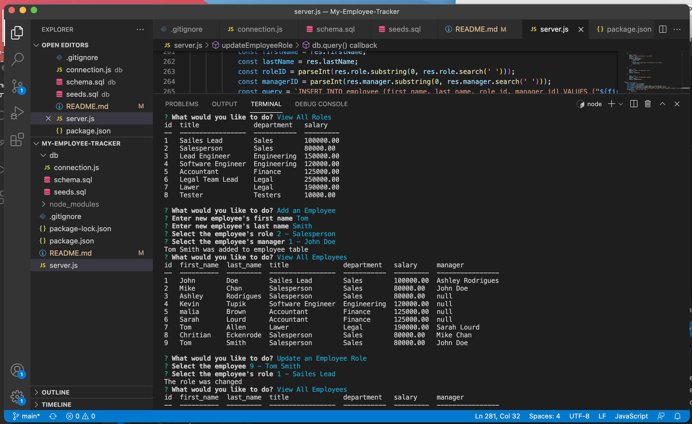

# My Employee Tracker  [](https://opensource.org/licenses/MIT)
A command-line application to manage a company's employee database

## Technologies Used

* JavaScript (Node.js, Inquirer)
* MySQL

## Description 

A Node.js command-line application that enables you to view and manage the departments, roles, and employees in your company. When you start the app, you are presented with the following options: view all departments, view all roles, view all employees, add a department, add a role, add an employee, and update an employee role. Select the option to view or update data.

```
WHEN I choose to view all departments
THEN I am presented with a formatted table showing department names and department ids
WHEN I choose to view all roles
THEN I am presented with the job title, role id, the department that role belongs to, and the salary for that role
WHEN I choose to view all employees
THEN I am presented with a formatted table showing employee data, including employee ids, first names, last names, job titles, departments, salaries, and managers that the employees report to
WHEN I choose to add a department
THEN I am prompted to enter the name of the department and that department is added to the database
WHEN I choose to add a role
THEN I am prompted to enter the name, salary, and department for the role and that role is added to the database
WHEN I choose to add an employee
THEN I am prompted to enter the employee’s first name, last name, role, and manager and that employee is added to the database
WHEN I choose to update an employee role
THEN I am prompted to select an employee to update and their new role and this information is updated in the database 
```

## Table of Contents 
- [Installation](#installation)
- [Usage](#usage)
- [License](#license)
- [Demo](#demo)
- [Screenshot](#screenshot)
- [Questoins](#questions)
  
## Installation 
   ``` 
    npm i
  
   ```
  
## Usage
  Run the following command in a terminal at the root of this project 
   ```
    node server.js  or npm run start
   ```
   Then, answer propted questions.


## License 
  
  The MIT License

## Demo
  
  https://drive.google.com/file/d/1-zVIdEkKDECnP3vSntt_gWGID9OO7xwE/view

## Screenshot
  
   
   
## Questions
  If you hane any questions:
  
  Get in touch with me on Github [Irina-Golubitsky](https://github.com/Irina-Golubitsky)
  
  Email me irina.golubitsky@gmail.com
